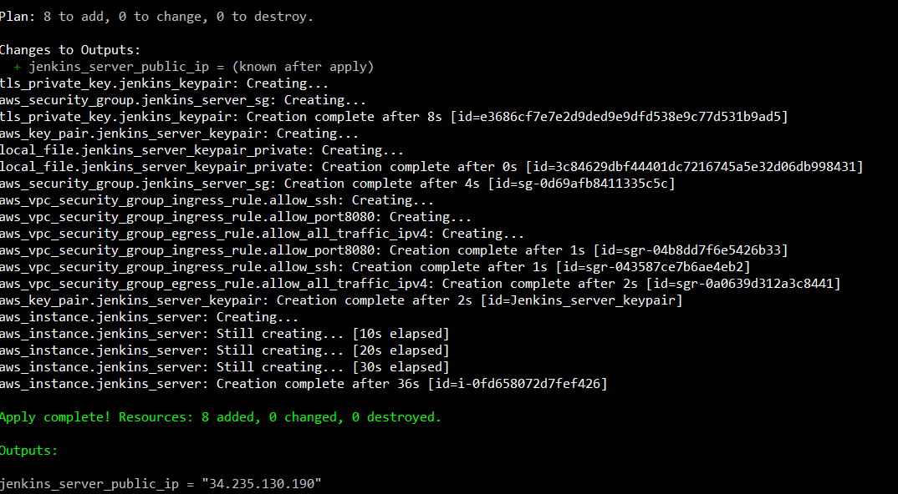
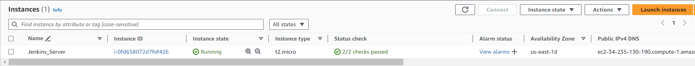
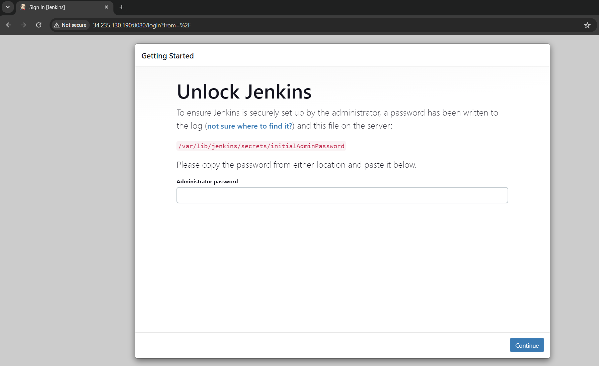
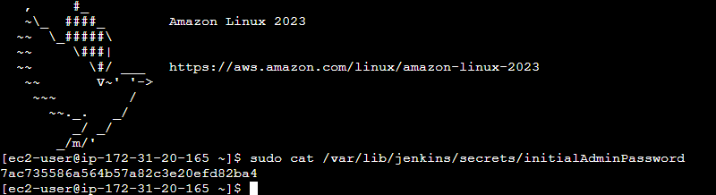
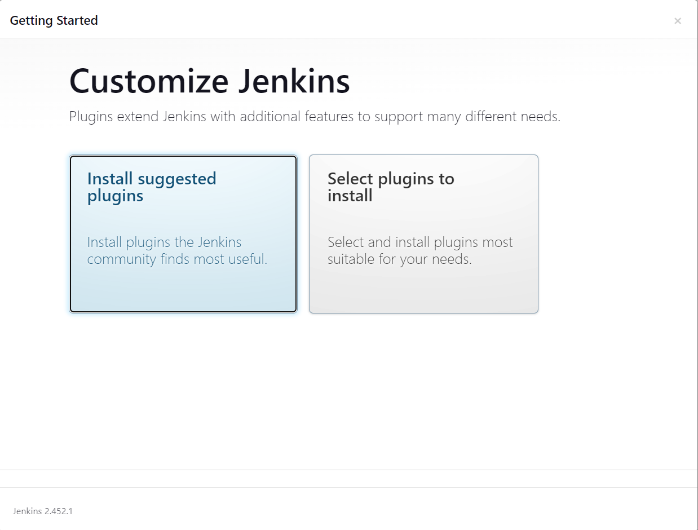
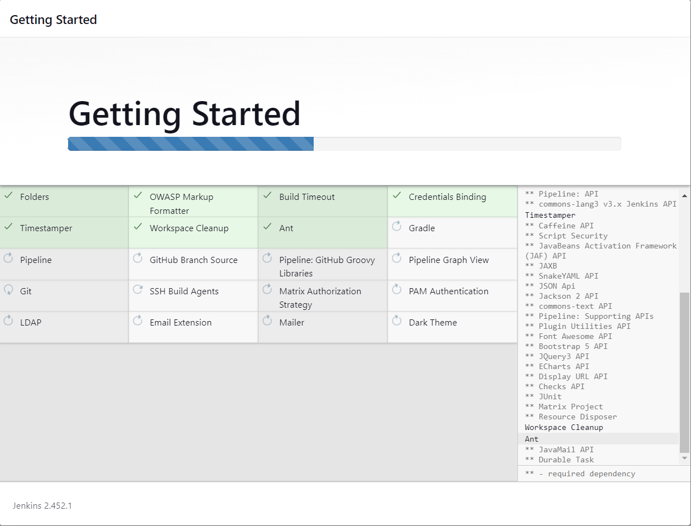
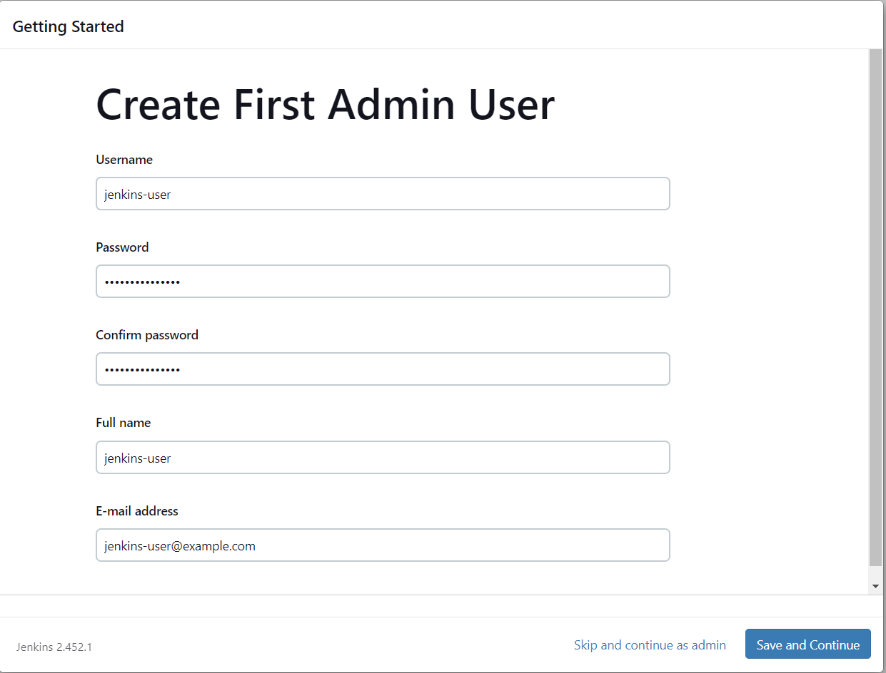
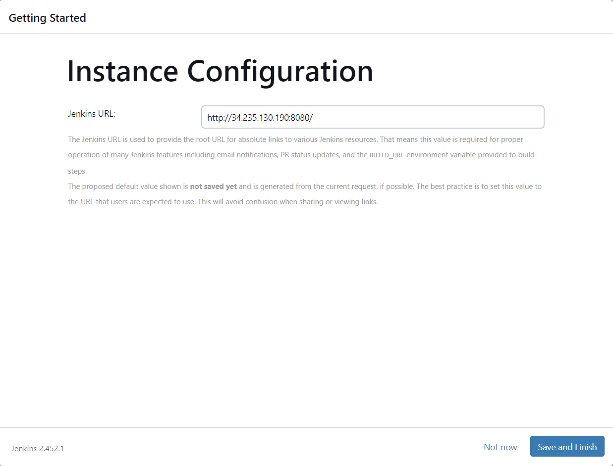
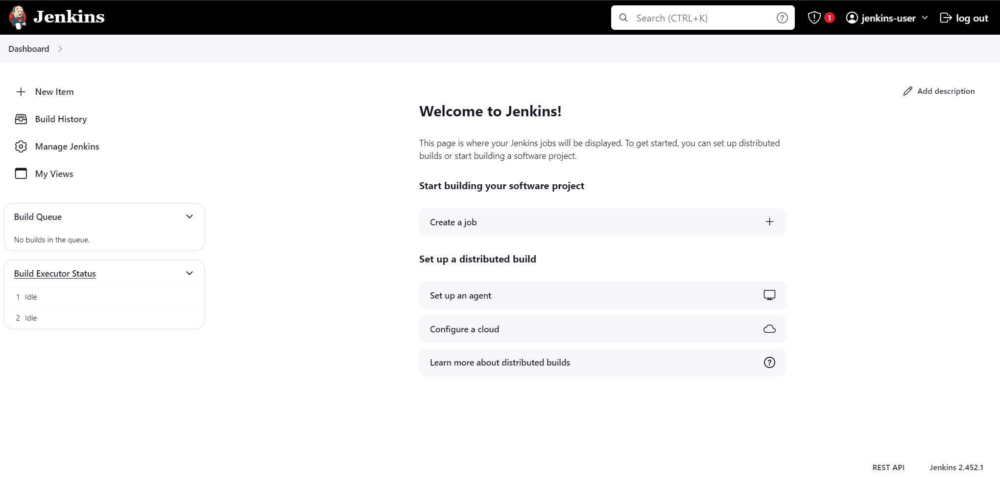

# Setting up Jenkins Server with AWS EC2

## Introduction

Jenkins is an open-source automation server that facilitates Continuous Integration and Continuous Delivery (CI/CD) by automating the build, test, and deployment processes of software projects. 
<br/>
In this project, I'll host my Jenkins server on AWS EC2 and install Terraform. Instead of deploying EC2 via the AWS console, I'll use Terraform for this purpose.

## Prerequisites
Before getting started, ensure that the following prerequisites are in place:
1. AWS CLI configured with your AWS account credentials.
2. A text editor (e.g. Visual Studio Code).
2. Terraform installed

## Configuration Files
1. **provider.tf**: This file contains the provider definition (AWS) and the region(us-east-1) for the architecture setup.

2. **main.tf**: This file contains the configuration code for setting up the Jenkins server EC2.
   * The security group allows SSH and port 8080 connections. For security reasons, the security group should ideally allow connections only from specific IP addresses. However, for the sake of simplicity in this project, I have chosen to allow connections from anywhere.

3. **variable.tf**: This file contains the variable definitions for the project.

4. **output.tf**: This file contains the output for the EC2 public IP address. This is required for us to access Jenkins via the web browser

5. **keypair.tf**: This file contains the configuration code to generate a keypair.

6. **install_jenkins.sh**: This script contains commands to set up Java, Jenkins and Terraform

## Getting Started

### Cloning from the repository

Open Git Bash and change the current working directory to the location where you want the cloned directory to be.
```
cd '/c/Users/YOUR USERNAME HERE/YOUR FOLDER HERE'
git clone https://LINKFROMGITHUB
```

### Deploying the infrastructure using terraform

Key in the below command line to start deploying the instance using Terraform.
```
terraform init  # Intialises provider plugin and modules
terraform plan  # Create the execution plan for the code
terraform apply # Creates the infrastructure
```
### AWS Resources

After the Terraform deployment is completed, you should be able to see the public IP address for the EC2 on the terminal.



To verify that your EC2 instance is running, log in to the AWS Management Console and navigate to the EC2 Dashboard. You should be able to see your EC2 instance listed under 'Instances' with a status of 'running'.



## Results

You should be able to see the Jenkins page when you access it. To access Jenkins, open a web browser and enter http://your_amazon_linux_instance_public_ip:8080. You should then see the 'Unlock Jenkins' page.



To retrieve the password and log in to Jenkins, SSH into the EC2 instance and use the following command. Windows users can utilize PuTTY with the generated key pair, while others can connect directly via the AWS console.
```
sudo cat /var/lib/jenkins/secrets/initialAdminPassword
```


After completing the previous steps, you will be directed to the following page. Here, select 'Install Suggested Plugins' to proceed with the installation.





Enter the required information to create the admin user, then click 'Save and Continue' to proceed.



After configuring the necessary settings, click 'Save and Finish' to confirm and finalize the Jenkins setup.



We have successfully installed Jenkins on EC2 and are now able to access the Jenkins homepage.



In the future, we might use this project as a foundation for setting up a Jenkins pipeline.

## Deleting 

Remember to delete your AWS resources after you are done.
```
# Remove all the resources using terraform destroy
terraform destroy 
```